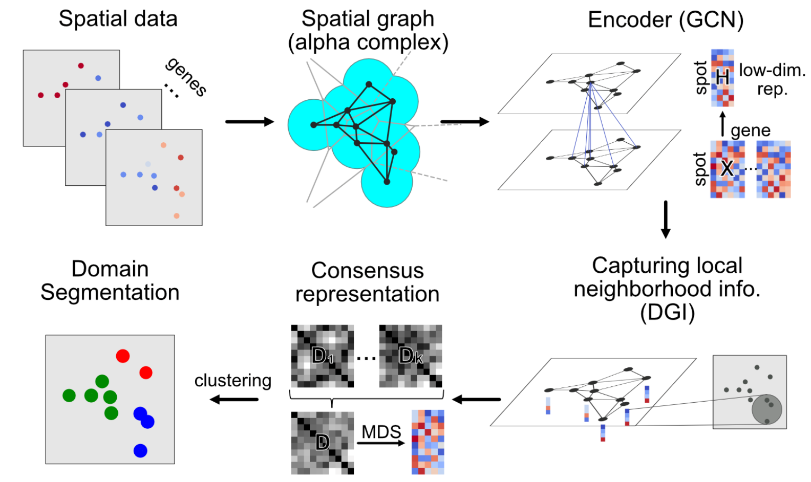
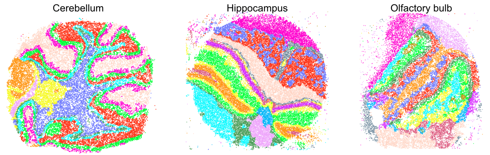

# SCAN-IT
Domain segmentation of spatial transcriptomics data.

See the `examples` folder for tutorials including seqFISH+ data and Slide-seq data.

Reference

[Zixuan Cang, Xinyi Ning, Annika Nie, Min Xu and Jing Zhang. *Scan-IT: Domain segmentation of spatial transcriptomics images by graph neural network*, British Machine Vision Conference, 2021.](https://www.bmvc2021-virtualconference.com/conference/papers/paper_1139.html)
